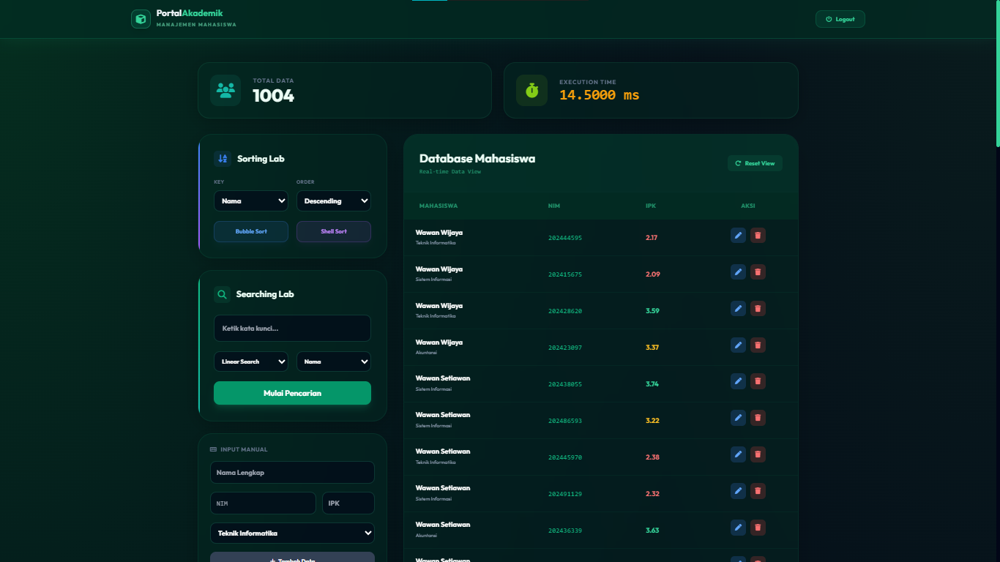

# 🎓 Portal Akademik - Manajemen Mahasiswa


> **Single Page Application (SPA)** pengelola data mahasiswa yang dibangun menggunakan **Vanilla JavaScript (ES6 Modules)**. Proyek ini mendemonstrasikan implementasi struktur modular modern, manipulasi DOM tanpa framework, serta visualisasi benchmark algoritma Sorting & Searching.

---

## 📸 Tampilan Antarmuka (Preview)



---

## ✨ Fitur Unggulan

### 1. 🏗️ Arsitektur Modular (ES6 Modules)
Meskipun tanpa Framework (React/Vue), aplikasi ini dibangun dengan **Component-Based Architecture**.
- **Terpisah:** Logika Bisnis, Manipulasi UI, dan Manajemen Data dipisah ke dalam modul berbeda.
- **Clean Code:** Menggunakan `import` dan `export` untuk manajemen dependensi yang rapi.
- **Component Injection:** Navbar, Modal, dan Halaman di-inject secara dinamis menggunakan JavaScript.

### 2. ⚡ Algoritma & Benchmarking
Fitur "Algorithm Lab" memungkinkan pengguna membandingkan kecepatan eksekusi secara real-time (dalam milidetik/ms):
- **Sorting:** Bubble Sort vs Shell Sort (Ascending/Descending).
- **Searching:** Linear Search vs Binary Search.
- **Big Data Simulation:** Generator data dummy (500+ data) untuk stress-test algoritma.

### 3. 🎨 UI/UX Modern (Glassmorphism)
- **Tema:** Dark Emerald dengan efek kaca (glassmorphism) dan backdrop blur.
- **Responsive:** Tampilan menyesuaikan desktop dan mobile.
- **Interaktif:** Animasi halus menggunakan **GSAP** (GreenSock) untuk transisi halaman dan elemen.

### 4. 💾 Persistensi Data
- **LocalStorage:** Data tersimpan di browser, tidak hilang saat di-refresh.
- **CRUD:** Create, Read, Update, dan Delete data mahasiswa sepenuhnya berfungsi.

---

## 🛠️ Teknologi yang Digunakan

| Kategori | Teknologi |
| :--- | :--- |
| **Core** | HTML5, CSS3, JavaScript (ES6+) |
| **Architecture** | MVC Pattern (Model-View-Controller) adaptation, ES Modules |
| **Styling** | Tailwind CSS (CDN) |
| **Icons** | FontAwesome 6 |
| **Animation** | GSAP (GreenSock Animation Platform) |

---

## 📂 Struktur Proyek

Struktur folder dirancang agar *scalable* dan mudah dipelihara (Maintainable):

```text
/project-root
│
├── index.html           # Entry Point (Skeleton)
├── css/
│    └── style.css       # Custom CSS (Glassmorphism & Overrides)
│
└── js/
     ├── main.js         # Main Logic & Event Listeners
     ├── utils.js        # Helper Functions
     ├── modules/        # Business Logic (Non-UI)
     │    ├── DataManager.js  # CRUD & LocalStorage Logic
     │    ├── Algorithms.js   # Bubble/Shell Sort & Search Logic
     │    └── UIManager.js    # DOM Manipulation & Rendering
     │
     └── components/     # HTML Components (String Templates)
          ├── Navbar.js
          ├── LandingPage.js
          ├── AuthPage.js
          ├── DashboardPage.js
          ├── EditModal.js
          └── Footer.js
````

-----

## 🚀 Cara Menjalankan (Installation)

Karena proyek ini menggunakan **ES6 Modules (`type="module"`)**, Anda **TIDAK BISA** membukanya hanya dengan double-click file `index.html` (karena kebijakan CORS browser).

Anda harus menjalankannya menggunakan **Local Server**.

### Prasyarat

  - Browser Modern (Chrome/Edge/Firefox).
  - Code Editor (VS Code direkomendasikan).

### Langkah-langkah

1.  **Clone Repositori ini**

    ```bash
    git clone [https://github.com/username-anda/portal-akademik-js.git](https://github.com/username-anda/portal-akademik-js.git)
    ```

2.  **Buka di VS Code**

    ```bash
    cd portal-akademik-js
    code .
    ```

3.  **Jalankan dengan Live Server**

      - Install Ekstensi **"Live Server"** oleh Ritwick Dey di VS Code.
      - Klik kanan pada `index.html`.
      - Pilih **"Open with Live Server"**.

4.  **Login Default**

      - Username: `admin`
      - Password: `admin123`

-----

## 🧠 Pembelajaran (Learning Outcomes)

Melalui proyek ini, saya mendalami konsep:

  - **JavaScript Modern:** Memahami `import/export`, `async/await`, dan `class` secara mendalam.
  - **Algorithm Complexity:** Memahami secara visual mengapa Shell Sort ($O(n \log n)$) jauh lebih cepat daripada Bubble Sort ($O(n^2)$) pada data yang besar.
  - **DOM Manipulation:** Membangun SPA manual memberi pemahaman kuat tentang bagaimana framework bekerja di balik layar ("Under the hood").

-----

## 🤝 Kontribusi

Pull requests dipersilakan. Untuk perubahan besar, harap buka issue terlebih dahulu untuk mendiskusikan apa yang ingin Anda ubah.

-----

## 📞 Kontak

Dibuat oleh **[Juzzoohh]**

[LinkeIn](https://www.google.com/search?q=https://linkedin.com/in/muhamad-ichsan-fachrulrozi-50216731b)
[Instagram](https://www.google.com/search?q=https://instagram.com/sanrozii)
